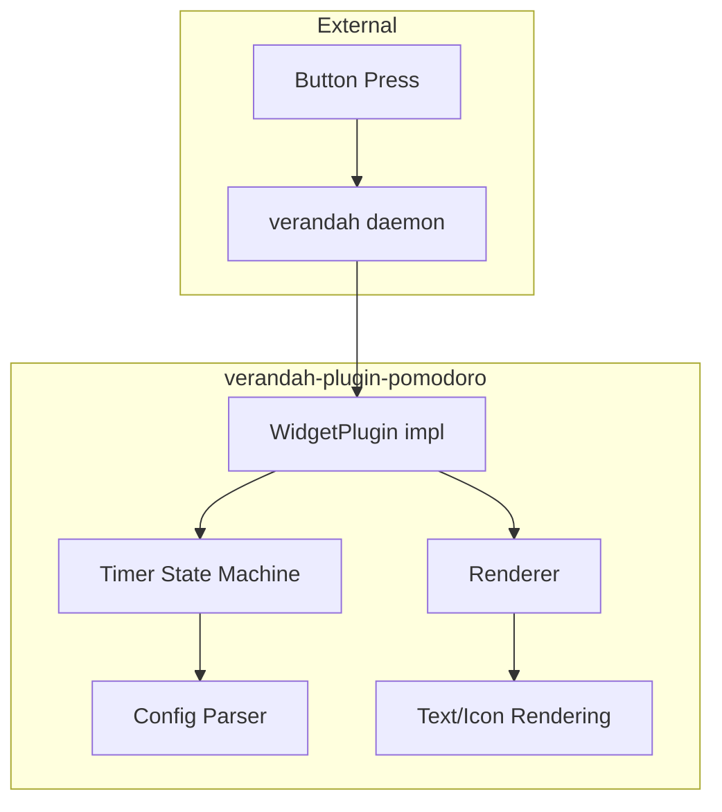

# Verandah Plugin Pomodoro - Implementation Plan

## Overview

A pomodoro timer plugin for verandah that displays timer state on a Stream Deck button, based on the timer logic from `waybar-module-pomodoro`.

## Dependency Strategy

### Problem
The `verandah-plugin-api` crate currently lives inside the verandah repo. External plugins need access to it without pulling in the entire verandah project.

### Options

1. **Git dependency (Recommended for now)**
   ```toml
   [dependencies]
   verandah-plugin-api = { git = "https://github.com/sw1nn/verandah", tag = "plugin-api-v0.4.0" }
   ```
   - Simple, works immediately
   - Requires verandah to tag releases or use specific commits

2. **Publish to crates.io (Future)**
   - Publish `verandah-plugin-api` as a standalone crate
   - Most ergonomic for external plugin authors
   - Requires versioning discipline

3. **Path dependency (Development only)**
   ```toml
   [dependencies]
   verandah-plugin-api = { path = "../verandah/main/verandah-plugin-api" }
   ```
   - Works for local development
   - Not portable

### Recommendation
Start with **path dependency** for development, document that external users should use git dependency. Eventually publish to crates.io when the API stabilizes.

---

## Architecture



## Components

### 1. Timer State Machine (from waybar-module-pomodoro)

Adapt the existing timer logic:

```rust
pub struct Timer {
    current_phase: Phase,      // Work, ShortBreak, LongBreak
    elapsed_secs: u64,
    durations: Durations,      // work, short_break, long_break
    iterations: u8,            // 0-3, resets after long break
    sessions_completed: u32,
    running: bool,
}

pub enum Phase {
    Work,
    ShortBreak,
    LongBreak,
}
```

Key behaviors:
- 4 work cycles + short breaks, then 1 long break = 1 session
- Auto-transition between phases (configurable)
- Pause/resume on button press

### 2. Plugin Configuration

```toml
[[keys]]
index = 5
[keys.widget]
id = "pomodoro"
[keys.widget.config]
work = "25"           # minutes
short_break = "5"     # minutes
long_break = "15"     # minutes
auto_start_work = "false"
auto_start_break = "false"
# Colors
work_bg = "c0392b"    # red
break_bg = "27ae60"   # green
paused_bg = "7f8c8d"  # gray
fg_color = "ffffff"
# Icons (optional paths to images)
work_icon = ""        # path to work icon
break_icon = ""       # path to break icon

[keys.action]
exec = "verandah-pomodoroctl toggle"  # Optional external control
```

### 3. Widget State

The plugin returns `PluginWidgetState::Text(remaining_time)` where remaining time is formatted as `MM:SS`.

The `poll_state` method:
1. Updates elapsed time if running
2. Checks for phase transitions
3. Returns remaining time as text

### 4. Rendering

Display on 72x72 button:
- Background color based on phase (work=red, break=green, paused=gray)
- Centered time display (large font): `25:00`
- Small phase indicator: `W` or `B` or icon
- Optional: iteration dots (●●○○ for 2/4 work cycles)

```
┌────────────────┐
│   ●●○○         │  <- iteration progress
│                │
│    25:00       │  <- remaining time (large)
│                │
│      W         │  <- phase indicator
└────────────────┘
```

### 5. Button Actions

verandah supports `[keys.action]` for button press. Options:

**Option A: External control binary**
- Create `verandah-pomodoroctl` binary
- Plugin listens on Unix socket
- Button action: `exec = "verandah-pomodoroctl toggle"`

**Option B: Plugin handles click internally**
- Would require verandah to pass click events to plugins
- Not currently supported by plugin API

**Recommendation**: Start with Option A (socket-based control) since it matches waybar-module-pomodoro architecture and doesn't require verandah API changes.

---

## Project Structure

```
verandah-plugin-pomodoro/
├── Cargo.toml
├── src/
│   ├── lib.rs           # Plugin entry point, WidgetPlugin impl
│   ├── timer.rs         # Timer state machine (adapted from waybar)
│   ├── config.rs        # Configuration parsing
│   ├── render.rs        # Button image rendering
│   └── error.rs         # Error types
├── src/bin/
│   └── verandah-pomodoroctl.rs  # Control binary
└── completions/
    └── _verandah-pomodoroctl    # Zsh completion
```

## Cargo.toml

```toml
[package]
name = "verandah-plugin-pomodoro"
version = "0.1.0"
edition = "2024"

[lib]
crate-type = ["cdylib"]

[[bin]]
name = "verandah-pomodoroctl"
path = "src/bin/verandah-pomodoroctl.rs"

[dependencies]
# Plugin API
verandah-plugin-api = { path = "../verandah/main/verandah-plugin-api" }
abi_stable = "0.11"

# Serialization
serde = { version = "1", features = ["derive"] }
serde_json = "1"

# Rendering
image = "0.25"
imageproc = "0.25"
ab_glyph = "0.2"
fontconfig = "0.6"

# Logging
tracing = "0.1"

# Error handling
derive_more = { version = "2", features = ["from", "display"] }

# IPC (for control socket)
# Consider: tokio with unix sockets, or simple std::os::unix
```

---

## Implementation Phases

### Phase 1: Basic Timer Display
- [ ] Set up project structure
- [ ] Implement `WidgetPlugin` trait
- [ ] Basic timer state machine (work only, no breaks)
- [ ] Simple text rendering of remaining time
- [ ] Manual start via config (always running)

### Phase 2: Full Pomodoro Cycle
- [ ] Complete state machine with work/short/long breaks
- [ ] Phase transitions with iteration tracking
- [ ] Color-coded backgrounds per phase
- [ ] Session counter

### Phase 3: Control & Persistence
- [ ] Unix socket for IPC
- [ ] `verandah-pomodoroctl` binary
- [ ] Commands: toggle, reset, skip, set-time
- [ ] State persistence to cache file

### Phase 4: Polish
- [ ] Notifications (via notify-rust)
- [ ] Sound support (via rodio)
- [ ] Icon support for phases
- [ ] Iteration progress indicator
- [ ] Zsh completions

---

## Questions to Resolve

1. **Notifications**: Should the plugin send notifications, or should that be handled externally? The waybar module handles it internally.

2. **Sound**: Same question - internal or external? Audio playback adds significant dependencies.

3. **Multi-instance**: Do we need multiple pomodoro timers on different buttons? The waybar module supports this.

4. **Click handling**: Would it be worth adding click event support to the verandah plugin API? This would simplify control without needing a separate socket.

5. **Publishing verandah-plugin-api**: When/how should this be published to crates.io for easier external plugin development?

---

## Comparison: waybar vs verandah plugin

| Feature | waybar-module-pomodoro | verandah-plugin-pomodoro |
|---------|------------------------|--------------------------|
| Display | Text in bar | 72x72 button image |
| Control | Socket commands | Socket commands + button action |
| Output | JSON to stdout | RGB image via poll_state/render |
| Polling | 100ms internal | Configurable via daemon |
| Multi-instance | Via socket path | Via widget config id? |
